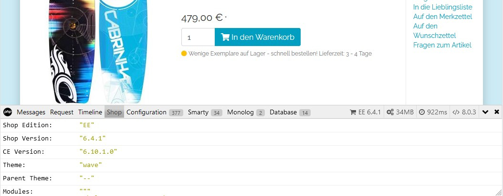

[](README.md)
[](README.en.md)

# D³ Debug Bar for OXID eShop

The debug bar enables the display of relevant debug information in the shop frontend.



## Table of content

- [Installation](#installation)
- [How to use](#how-to-use)
- [Changelog](#changelog)
- [Contributing](#contributing)
- [License](#license)
- [Further licenses and terms of use](#further-licenses-and-terms-of-use)

## Installation

This package requires an OXID eShop installed with Composer in a version defined in the [composer.json](composer.json).

Please enter the following section in the `composer.json` of your project:

```
  "extra": {
    "ajgl-symlinks": {
      "maximebf/debugbar": {
        "src/DebugBar/Resources": "source/out/debugbar"
      }
    },
    "enable-patching": "true",
    "patches": {
      "oxid-esales/oxideshop-ce": {
        "Add overridable functions for advanced profiling in Debug Bar": "https://git.d3data.de/D3Public/DebugBar/raw/branch/patches/overridablefunctions.patch"
      }
    }
  }
```

Open a command line and navigate to the root directory of the shop (parent directory of source and vendor). Execute the following command. Adapt the path details to your installation environment.

```bash
php composer require d3/oxid-debugbar:^1.0
``` 

If necessary, please confirm that you allow `composer-symlinker` and `composer-patches` to execute code.

Have the files of the package `oxid-esales/oxideshop-ce` overwritten.

Activate the module in Shopadmin under "Extensions -> Modules".

## How to use

__Please note that the DebugBar contains security-relevant information. It should therefore not be activated under any circumstances in a freely accessible installation.__

The DebugBar displays the following tabs:
- Messages
  can contain individual debug output. The messages can be set within the PHP code with `debugVar($message)` and corresponds to the OXID function `dumpVar(...)`
- Request
  shows all information from GET and POST requests, as well as session, cookie and server variables
- Timeline
  displays all areas defined with `startProfile` and `stopProfile` with single and summed execution time as well as a waterfall diagram
- Shop
  shows basic shop information (edition, versions, theme information)
- Configuration
  provides all configuration settings of the shop from database and config files
- Smarty
  lists all variables of the template engine that are available on the current shop page
- Monolog
  lists all log messages passed to the Monolog Logger
- Database
  shows all database queries necessary to generate the current page

## Changelog

See [CHANGELOG](CHANGELOG.md) for further informations.

## Contributing

If you have a suggestion that would make this better, please fork the repo and create a pull request. You can also simply open an issue. Don't forget to give the project a star! Thanks again!

- Fork the Project
- Create your Feature Branch (git checkout -b feature/AmazingFeature)
- Commit your Changes (git commit -m 'Add some AmazingFeature')
- Push to the Branch (git push origin feature/AmazingFeature)
- Open a Pull Request

## License
(status: 2022-07-30)

Distributed under the GPLv3 license.

```
Copyright (c) D3 Data Development (Inh. Thomas Dartsch)

This software is distributed under the GNU GENERAL PUBLIC LICENSE version 3.
```

For full copyright and licensing information, please see the [LICENSE](LICENSE.md) file distributed with this source code.

## Further licenses and terms of use

### Smarty collector
([https://github.com/Junker/php-debugbar-smarty/blob/master/LICENSE](https://github.com/Junker/php-debugbar-smarty/blob/master/LICENSE) - status 2022-07-31)

```
The MIT License (MIT)

Copyright (c) 2016 Dmitry Kosenkov

Permission is hereby granted, free of charge, to any person obtaining a copy
of this software and associated documentation files (the "Software"), to deal
in the Software without restriction, including without limitation the rights
to use, copy, modify, merge, publish, distribute, sublicense, and/or sell
copies of the Software, and to permit persons to whom the Software is
furnished to do so, subject to the following conditions:

The above copyright notice and this permission notice shall be included in all
copies or substantial portions of the Software.

THE SOFTWARE IS PROVIDED "AS IS", WITHOUT WARRANTY OF ANY KIND, EXPRESS OR
IMPLIED, INCLUDING BUT NOT LIMITED TO THE WARRANTIES OF MERCHANTABILITY,
FITNESS FOR A PARTICULAR PURPOSE AND NONINFRINGEMENT. IN NO EVENT SHALL THE
AUTHORS OR COPYRIGHT HOLDERS BE LIABLE FOR ANY CLAIM, DAMAGES OR OTHER
LIABILITY, WHETHER IN AN ACTION OF CONTRACT, TORT OR OTHERWISE, ARISING FROM,
OUT OF OR IN CONNECTION WITH THE SOFTWARE OR THE USE OR OTHER DEALINGS IN THE
SOFTWARE.
```